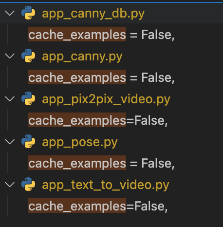

# Text2Video-Zero-sd-webui

- clone this repo to `/path/to/stable-diffusion-webui/extensions`
- get `annotator` and `__assets__` folders from this [link](https://huggingface.co/spaces/PAIR/Text2Video-Zero/tree/main) and put them in `/path/to/stable-diffusion-webui/extensions/Text2Video-Zero-sd-webui`
- relaunch your webui, the first launch may take a few minutes for caching video examples.
- may need to add `--disable-safe-unpickle` to `bash webui.sh` when launch

## Issues
- To diable caching examples everytime webui launching
  - Within the directory `/path/to/stable-diffusion-webui/extensions/Text2Video-Zero-sd-webui`, use your favorite code editor search for `cache_examples` in codes and set them to False

